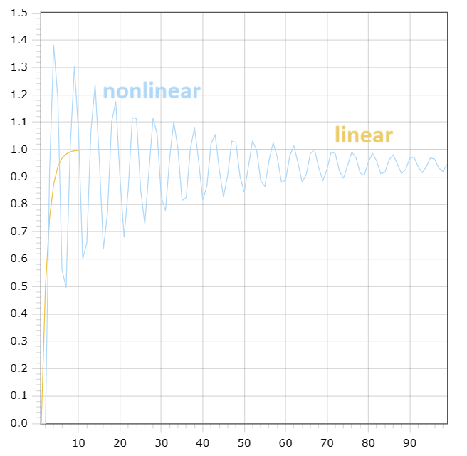

<p align="center"> Министерство образования Республики Беларусь</p>
<p align="center">Учреждение образования</p>
<p align="center">“Брестский Государственный технический университет”</p>
<p align="center">Кафедра ИИТ</p>
<br><br><br><br><br><br><br>
<p align="center">Лабораторная работа №1</p>
<p align="center">По дисциплине “Общая теория интеллектуальных систем”</p>
<p align="center">Тема: “Моделирования температуры объекта”</p>
<br><br><br><br><br>
<p align="right">Выполнил:</p>
<p align="right">Студент 2 курса</p>
<p align="right">Группы ИИ-23</p>
<p align="right">Лапин В.А.</p>
<p align="right">Проверил:</p>
<p align="right">Иванюк Д. С.</p>
<br><br><br><br><br>
<p align="center">Брест 2023</p>

---

# Общее задание #
1. Написать отчет по выполненной лабораторной работе №1 в .md формате (readme.md) и с помощью запроса на внесение изменений (**pull request**) разместить его в следующем каталоге: **trunk\ii0xxyy\task_01\doc** (где **xx** - номер группы, **yy** - номер студента, например **ii02102**).
2. Исходный код написанной программы разместить в каталоге: **trunk\ii0xxyy\task_01\src**.

## Task 1. Modeling controlled object ##
Let's get some object to be controlled. We want to control its temperature, which can be described by this differential equation:

$$\Large\frac{dy(\tau)}{d\tau}=\frac{u(\tau)}{C}+\frac{Y_0-y(\tau)}{RC} $$ (1)

where $\tau$ – time; $y(\tau)$ – input temperature; $u(\tau)$ – input warm; $Y_0$ – room temperature; $C,RC$ – some constants.

After transformation we get these linear (2) and nonlinear (3) models:

$$\Large y_{\tau+1}=ay_{\tau}+bu_{\tau}$$ (2)
$$\Large y_{\tau+1}=ay_{\tau}-by_{\tau-1}^2+cu_{\tau}+d\sin(u_{\tau-1})$$ (3)

where $\tau$ – time discrete moments ($1,2,3{\dots}n$); $a,b,c,d$ – some constants.

Task is to write program (**C++**), which simulates this object temperature.

---

# Выполнение задания #

Код программы:
```C++
 #include <iostream>
#include <cmath>
using namespace std;
double a = 0.5;
double b = 0.5;
double c = 0.5;
double d = 0.5;
double u = 1;
double y = 0.0;

void linearmod(int t, double y) {
    for (int n = 0; n <= t; n++) {
        cout << y << endl;
        y = a * y + b * u;
    }
}

void unlinearmodel(double y, double yprev, double u, double uprev, int t) {
    for (int i = 1; i <= t; i++) {
        cout << y << endl;
        double ynext = a * y - b * pow(yprev, 2) + c * u + d * sin(uprev);
        yprev = y;
        uprev = u;
        y = ynext;
    }
}

int main() {
    int t = 12;
    cout << "linear model" << endl;
    linearmod(t, y);

    cout << "________________________" << endl;

    cout << "unlinear model" << endl;
    unlinearmodel(y, y, u, u, t);

    return 0;
}
```вывод
	linear model
	0
	0.5
	0.75
	0.875
	0.9375
	0.96875
	0.984375
	0.992188
	0.996094
	0.998047
	0.999023
	0.999512
	0.999756
	________________________
	unlinear model
	0
	0.920735
	1.3811
	1.18741
	0.560718
	0.496123
	1.01159
	1.30346
	1.06081
	0.601629
	0.658896
	1.0692

